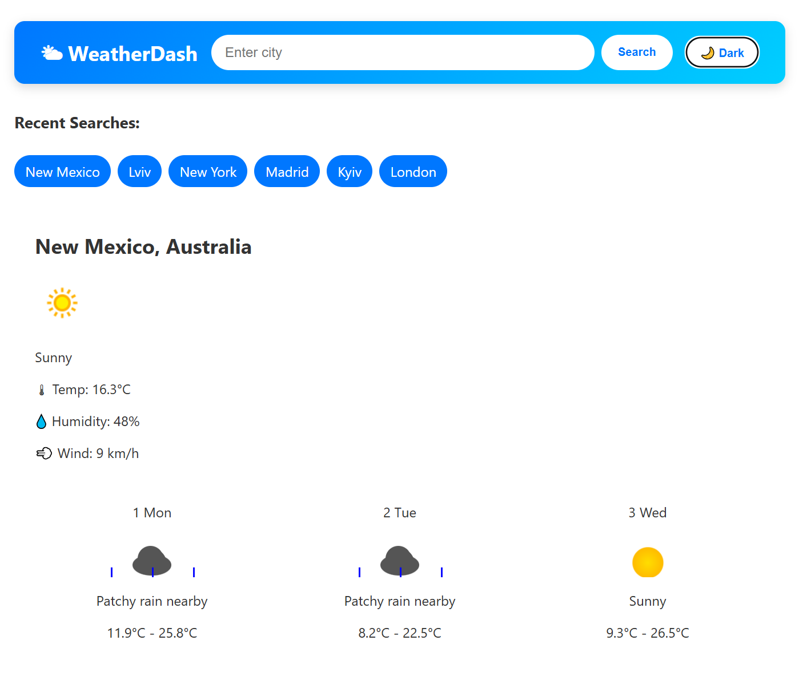
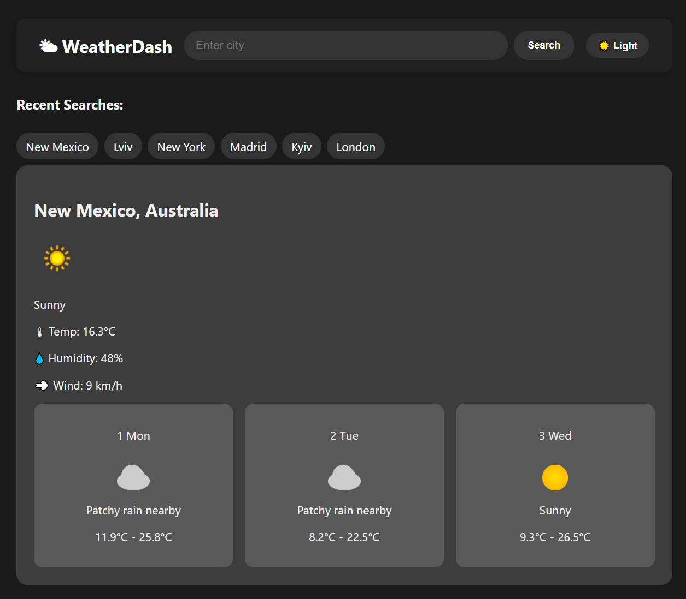

# WeatherDash 🌤️

WeatherDash is a modern, responsive weather dashboard built with **React**. It shows current weather and a 3-day forecast with animated icons for sun, clouds, and rain. Users can switch between **light** and **dark themes** and view their recent searches.

## Features

- Current weather display (temperature, humidity, wind, condition)  
- 3-day forecast with **animated weather icons**  
- Switch between **light and dark themes**  
- Search history stored locally (Recent Searches)  
- Responsive design (desktop, tablet, mobile)  

## Screenshots

### Light Theme

### Dark Theme

